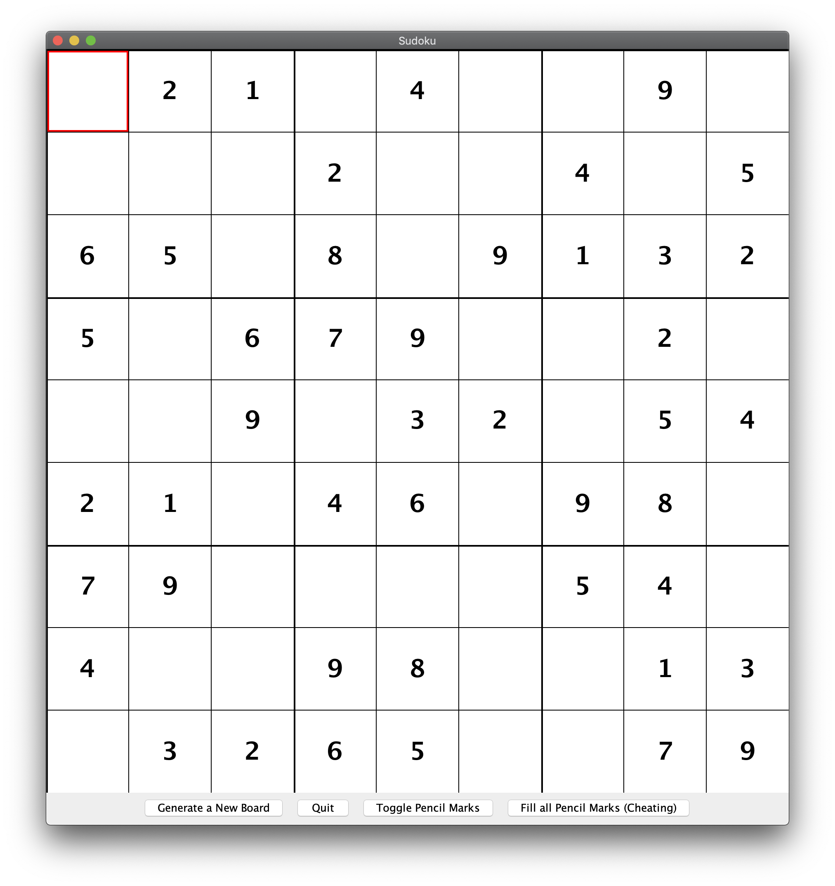
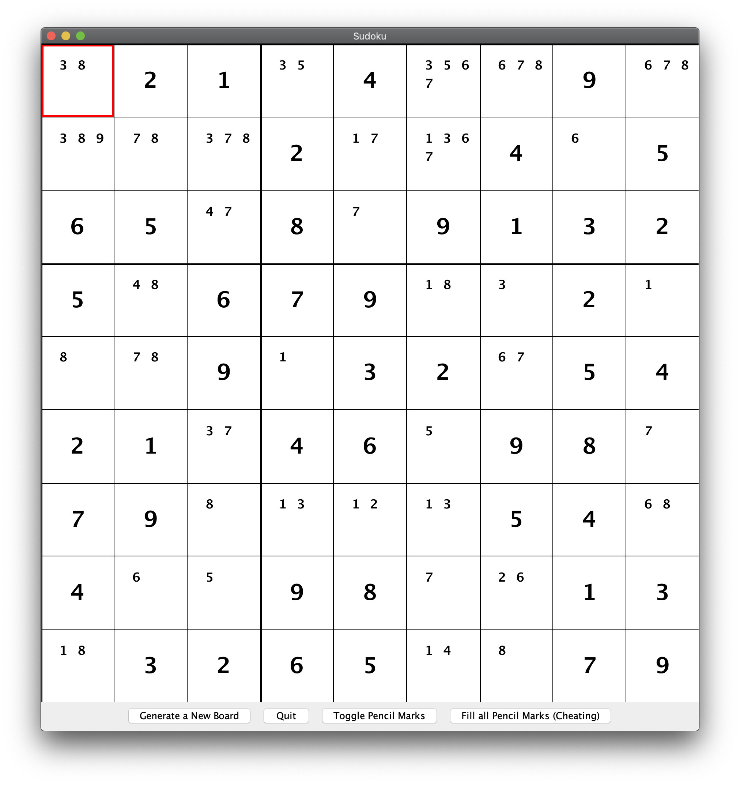
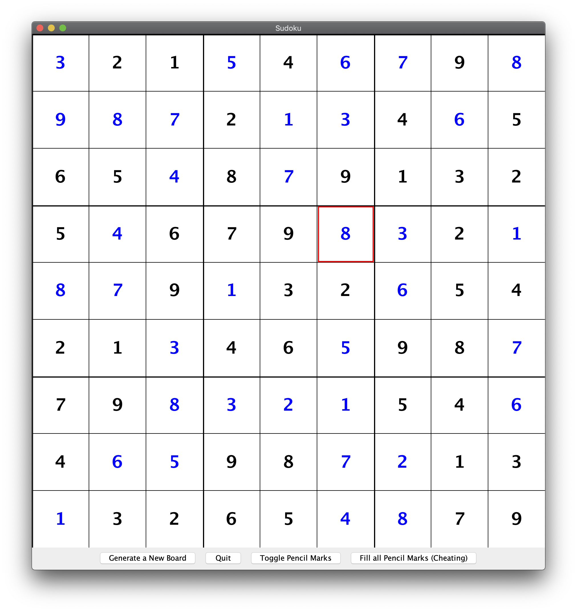

# Sudoku
A small little suduko game that I wrote as a final project for my into CS class. The program generates unique sudoku puzzles, and lets the user solve them. 

To play, run the main method of the launcher class. After the program is open generate a new board, and fill in values of the sudoku grid. Arrow keys select different cells, and number keys fill in answers. Press the toggle pencil marks button if there are multiple values that a cell might have (the program will update these as you make guesses). It's considered cheating, but if the puzzle is too hard you can have the program display all the possible pencil marks to make it easier.

